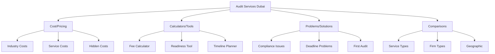

# Bonus Content Map - Topical Authority Amplification Strategy

## Strategic Overview

This bonus content map provides supplementary topical clusters that strengthen the main audit firm topical authority through:
1. **Interactive Tools** - Engagement + backlinks
2. **Cost Intelligence** - Commercial investigation intent
3. **Comparison Matrices** - Decision-stage content
4. **Problem-Solution Pairs** - Long-tail capture
5. **Temporal Content** - Freshness signals
6. **Micro-Niches** - Comprehensive coverage
7. **Data Studies** - Link magnets
8. **Process Maps** - Visual authority

## 1. Interactive Calculator Hub

### Core Calculator Framework
```typescript
// Topical Entity: "Audit Cost Calculation"
// Semantic Relationships: Pricing, Budgeting, Financial Planning
// Search Intent: Commercial Investigation

export const calculatorHub = {
  mainHub: {
    url: "/calculators",
    title: "Free Audit Calculators & Tools for Dubai Businesses",
    description: "Professional audit planning tools and calculators",
    wordCount: 2500,
    semanticDepth: "Overview of all calculators with use cases"
  },
  
  calculators: [
    {
      name: "Audit Fee Calculator",
      url: "/calculators/audit-fee-calculator",
      entities: ["audit cost", "pricing", "budget estimation"],
      features: [
        "Company size inputs",
        "Industry multipliers",
        "Complexity factors",
        "Free zone adjustments",
        "Instant quote range"
      ],
      contentSupport: {
        guide: "/guides/understanding-audit-fees-dubai",
        faq: "/faq/audit-pricing",
        comparison: "/audit-cost-comparison-dubai"
      }
    },
    
    {
      name: "Audit Readiness Assessment",
      url: "/calculators/audit-readiness-score",
      entities: ["audit preparation", "compliance readiness", "risk assessment"],
      features: [
        "50-point checklist",
        "Risk scoring",
        "Preparation timeline",
        "Document checklist generator",
        "Personalized report"
      ],
      contentSupport: {
        guide: "/guides/audit-preparation-timeline",
        checklist: "/downloads/audit-readiness-checklist",
        tips: "/blog/improve-audit-readiness-score"
      }
    },
    
    {
      name: "Materiality Calculator",
      url: "/calculators/materiality-threshold",
      entities: ["materiality", "audit threshold", "financial significance"],
      features: [
        "Revenue-based calculation",
        "Asset-based calculation",
        "Industry benchmarks",
        "IFRS guidelines",
        "Performance vs planning materiality"
      ],
      contentSupport: {
        guide: "/guides/understanding-materiality-in-auditing",
        standards: "/ifrs/materiality-standards",
        examples: "/case-studies/materiality-applications"
      }
    },
    
    {
      name: "VAT Penalty Calculator",
      url: "/calculators/vat-penalty-dubai",
      entities: ["VAT penalty", "tax compliance", "fine calculation"],
      features: [
        "Late filing penalties",
        "Error correction costs",
        "Interest calculations",
        "Penalty waiver eligibility",
        "Payment timeline"
      ],
      contentSupport: {
        guide: "/guides/avoiding-vat-penalties-dubai",
        updates: "/news/vat-penalty-changes-2025",
        help: "/services/vat-compliance-audit"
      }
    },
    
    {
      name: "Audit Timeline Planner",
      url: "/calculators/audit-timeline",
      entities: ["audit duration", "project planning", "deadline management"],
      features: [
        "Company size factors",
        "Document readiness impact",
        "Regulatory deadlines",
        "Express service options",
        "Milestone tracking"
      ],
      contentSupport: {
        process: "/guides/audit-process-timeline",
        express: "/services/express-audit-dubai",
        planning: "/resources/audit-project-planning"
      }
    },
    
    {
      name: "ROI Calculator for Internal Audit",
      url: "/calculators/internal-audit-roi",
      entities: ["internal audit value", "ROI", "cost-benefit analysis"],
      features: [
        "Risk reduction value",
        "Efficiency gains",
        "Fraud prevention savings",
        "Compliance cost avoidance",
        "5-year projection"
      ],
      contentSupport: {
        benefits: "/guides/internal-audit-benefits",
        cases: "/case-studies/internal-audit-roi",
        service: "/services/internal-audit-dubai"
      }
    },
    
    {
      name: "Free Zone Comparison Tool",
      url: "/calculators/free-zone-audit-requirements",
      entities: ["free zone requirements", "zone comparison", "regulatory differences"],
      features: [
        "45+ free zones",
        "Audit thresholds",
        "Deadline variations",
        "Document requirements",
        "Cost differences"
      ],
      contentSupport: {
        guide: "/guides/free-zone-audit-requirements",
        zones: "/locations/free-zones-dubai",
        updates: "/news/free-zone-regulations-2025"
      }
    }
  ]
}
```

### Calculator Content Architecture
```markdown
## Each Calculator Page Structure

1. **Interactive Tool Section** (Top)
   - Embedded calculator
   - Clear input fields
   - Instant results
   - Save/Email results option

2. **Educational Content** (2000+ words)
   - What is [calculation topic]?
   - Why it matters for Dubai businesses
   - Factors affecting calculations
   - Industry standards and benchmarks
   - Common mistakes to avoid

3. **Semantic Entity Integration**
   - Related regulations
   - Industry variations
   - Dubai-specific factors
   - International standards

4. **Supporting Elements**
   - Video tutorial
   - FAQ section
   - Related calculators
   - Expert consultation CTA
   - Downloadable report template
```

## 2. Cost & Pricing Intelligence Center

### Comprehensive Pricing Content Cluster
```typescript
export const pricingAuthority = {
  pillar: {
    url: "/audit-costs-dubai",
    title: "Complete Guide to Audit Costs in Dubai 2025",
    wordCount: 7500,
    sections: [
      "Market Overview",
      "Pricing Factors",
      "Service Comparisons",
      "Hidden Costs",
      "Cost Optimization",
      "ROI Analysis"
    ]
  },
  
  clusters: [
    {
      category: "Service-Specific Costs",
      pages: [
        {
          url: "/costs/external-audit-pricing",
          title: "External Audit Costs in Dubai: Complete Breakdown",
          entities: ["external audit fees", "statutory audit pricing"],
          wordCount: 3000,
          schema: "FAQPage, HowTo"
        },
        {
          url: "/costs/internal-audit-pricing",
          title: "Internal Audit Service Costs: Investment vs Return",
          entities: ["internal audit investment", "risk assessment costs"],
          wordCount: 2500
        },
        {
          url: "/costs/forensic-audit-fees",
          title: "Forensic Audit Pricing: When and Why to Invest",
          entities: ["forensic investigation costs", "fraud audit fees"],
          wordCount: 2500
        },
        {
          url: "/costs/due-diligence-pricing",
          title: "Due Diligence Costs for M&A in Dubai",
          entities: ["due diligence fees", "M&A audit costs"],
          wordCount: 2500
        }
      ]
    },
    
    {
      category: "Comparison Content",
      pages: [
        {
          url: "/compare/big-4-vs-boutique-pricing",
          title: "Big 4 vs Boutique Audit Firm Costs in Dubai",
          entities: ["audit firm comparison", "pricing differences"],
          wordCount: 3500,
          features: ["Comparison table", "Value analysis", "Case studies"]
        },
        {
          url: "/compare/local-vs-international-auditors",
          title: "Local vs International Audit Firm Pricing",
          entities: ["local auditors", "international firms"],
          wordCount: 2500
        },
        {
          url: "/compare/audit-costs-by-industry",
          title: "Industry-Specific Audit Costs in Dubai",
          entities: ["industry pricing", "sector costs"],
          wordCount: 4000,
          industries: [
            "Real Estate",
            "Trading",
            "Manufacturing",
            "Healthcare",
            "Technology",
            "Hospitality"
          ]
        }
      ]
    },
    
    {
      category: "Cost Optimization",
      pages: [
        {
          url: "/guides/reduce-audit-costs",
          title: "10 Ways to Reduce Audit Costs Without Compromising Quality",
          entities: ["cost reduction", "audit efficiency"],
          wordCount: 3000
        },
        {
          url: "/guides/audit-preparation-savings",
          title: "How Proper Preparation Saves 30% on Audit Costs",
          entities: ["preparation impact", "cost savings"],
          wordCount: 2500
        },
        {
          url: "/guides/avoiding-audit-penalties",
          title: "Avoiding Costly Audit Penalties in Dubai",
          entities: ["penalty avoidance", "compliance costs"],
          wordCount: 2500
        }
      ]
    }
  ]
}
```

## 3. Problem-Solution Content Pairs

### Addressing Specific Pain Points
```typescript
export const problemSolutionMap = {
  structure: "Problem-Agitate-Solution (PAS) Framework",
  semanticPattern: "Problem Entity -> Solution Entity -> Service Entity",
  
  contentPairs: [
    {
      problem: {
        url: "/problems/missed-audit-deadline",
        title: "Missed Your Audit Deadline in Dubai? Here's What Happens",
        entities: ["audit deadline", "late filing", "penalties"],
        content: [
          "Penalty structure",
          "Legal implications",
          "Business impact",
          "Regulatory consequences"
        ]
      },
      solution: {
        url: "/solutions/emergency-audit-service",
        title: "Emergency Audit Service: Meeting Impossible Deadlines",
        entities: ["express audit", "urgent service", "deadline recovery"],
        content: [
          "72-hour audit process",
          "Penalty mitigation",
          "Compliance restoration",
          "Future prevention"
        ]
      }
    },
    
    {
      problem: {
        url: "/problems/audit-qualification-issues",
        title: "Dealing with Qualified Audit Opinions in UAE",
        entities: ["qualified opinion", "audit issues", "compliance problems"],
        wordCount: 2500
      },
      solution: {
        url: "/solutions/audit-remediation-services",
        title: "Audit Remediation: From Qualified to Clean Opinion",
        entities: ["audit remediation", "compliance improvement"],
        wordCount: 3000
      }
    },
    
    {
      problem: {
        url: "/problems/first-time-audit-confusion",
        title: "First Audit? Common Mistakes Dubai Startups Make",
        entities: ["first audit", "startup audit", "audit mistakes"],
        wordCount: 3000
      },
      solution: {
        url: "/solutions/startup-audit-guide",
        title: "Startup Audit Success: Complete First-Time Guide",
        entities: ["startup guidance", "first audit preparation"],
        wordCount: 3500
      }
    },
    
    {
      problem: {
        url: "/problems/multi-jurisdiction-complexity",
        title: "Managing Audits Across Multiple UAE Emirates",
        entities: ["multi-jurisdiction", "cross-emirate audit"],
        wordCount: 2500
      },
      solution: {
        url: "/solutions/unified-audit-approach",
        title: "Unified Audit Strategy for Multi-Emirate Operations",
        entities: ["consolidated audit", "unified approach"],
        wordCount: 3000
      }
    },
    
    {
      problem: {
        url: "/problems/ifrs-transition-challenges",
        title: "IFRS Transition Problems Facing Dubai Businesses",
        entities: ["IFRS challenges", "accounting transition"],
        wordCount: 3000
      },
      solution: {
        url: "/solutions/ifrs-implementation-support",
        title: "Smooth IFRS Transition: Expert Implementation Guide",
        entities: ["IFRS implementation", "transition support"],
        wordCount: 3500
      }
    }
  ]
}
```

## 4. Temporal & Seasonal Content Strategy

### Time-Sensitive Topical Coverage
```typescript
export const temporalContent = {
  seasonal: [
    {
      period: "Q4 (October-December)",
      theme: "Year-End Preparation",
      content: [
        {
          url: "/seasonal/year-end-audit-checklist",
          title: "Year-End Audit Checklist for Dubai Businesses",
          publish: "October 1",
          update: "Annually"
        },
        {
          url: "/seasonal/december-deadline-guide",
          title: "December Audit Deadlines: Complete Timeline",
          publish: "November 15",
          urgency: "High"
        }
      ]
    },
    
    {
      period: "Q1 (January-March)",
      theme: "New Year Compliance",
      content: [
        {
          url: "/seasonal/new-year-audit-requirements",
          title: "2025 Audit Requirements: What's Changed",
          publish: "January 5",
          evergreen: false
        },
        {
          url: "/seasonal/march-31-deadline",
          title: "March 31 Deadline: Last-Minute Audit Guide",
          publish: "March 1",
          urgency: "Critical"
        }
      ]
    },
    
    {
      period: "Ramadan Period",
      theme: "Ramadan Business Considerations",
      content: [
        {
          url: "/seasonal/ramadan-audit-planning",
          title: "Audit Planning During Ramadan: Timing Considerations",
          cultural: true,
          annual: true
        }
      ]
    }
  ],
  
  regulatory: [
    {
      trigger: "New Regulation",
      template: {
        url: "/updates/[regulation-name]-impact",
        title: "[Regulation] Impact on Dubai Businesses",
        structure: [
          "What changed",
          "Who's affected",
          "Compliance timeline",
          "Action items",
          "Expert analysis"
        ]
      }
    }
  ],
  
  annual: [
    {
      url: "/annual/state-of-audit-dubai-2025",
      title: "State of Audit 2025: Dubai Market Report",
      type: "Original Research",
      wordCount: 10000,
      sections: [
        "Market size and growth",
        "Regulatory changes",
        "Industry trends",
        "Fee benchmarks",
        "Technology adoption",
        "Future outlook"
      ]
    }
  ]
}
```

## 5. Micro-Niche Authority Building

### Ultra-Specific Content Coverage
```typescript
export const microNicheContent = {
  strategy: "Cover every conceivable scenario",
  semanticDepth: "Establish authority through comprehensiveness",
  
  clusters: [
    {
      niche: "Free Zone Specific",
      pages: [
        "/dmcc/dmcc-audit-requirements-guide",
        "/difc/difc-financial-audit-rules",
        "/dafza/dafza-audit-compliance",
        "/jafza/jebel-ali-audit-process",
        "/dso/dubai-silicon-oasis-audit",
        "/dubai-south/dubai-south-audit-requirements",
        "/meydan/meydan-free-zone-audit",
        // ... 40+ free zone specific pages
      ]
    },
    
    {
      niche: "Industry + Service Combinations",
      matrix: [
        {
          industry: "Real Estate",
          services: [
            "/real-estate/rera-audit-complete-guide",
            "/real-estate/escrow-account-audit",
            "/real-estate/property-management-audit",
            "/real-estate/reit-audit-requirements"
          ]
        },
        {
          industry: "Healthcare",
          services: [
            "/healthcare/dha-compliance-audit",
            "/healthcare/medical-practice-audit",
            "/healthcare/pharmaceutical-audit-dubai",
            "/healthcare/hospital-internal-audit"
          ]
        },
        {
          industry: "F&B",
          services: [
            "/fnb/restaurant-audit-dubai",
            "/fnb/food-safety-compliance-audit",
            "/fnb/franchise-audit-requirements",
            "/fnb/multi-outlet-audit-strategy"
          ]
        }
      ]
    },
    
    {
      niche: "Company Structure Specific",
      pages: [
        "/llc/llc-audit-requirements-dubai",
        "/branch/foreign-branch-audit-uae",
        "/holding/holding-company-audit",
        "/subsidiary/subsidiary-audit-consolidation",
        "/partnership/partnership-audit-dubai",
        "/sole-proprietorship/sole-proprietor-audit"
      ]
    },
    
    {
      niche: "Transaction Specific",
      pages: [
        "/ma/merger-acquisition-audit",
        "/ipo/ipo-readiness-audit-dubai",
        "/liquidation/liquidation-audit-process",
        "/restructuring/restructuring-audit-requirements",
        "/joint-venture/jv-audit-considerations"
      ]
    }
  ]
}
```

## 6. Data & Research Content Hub

### Original Research & Studies
```typescript
export const researchContent = {
  studies: [
    {
      title: "Dubai Audit Market Analysis 2025",
      url: "/research/dubai-audit-market-2025",
      methodology: "Survey of 500+ Dubai businesses",
      sections: [
        "Market size and segmentation",
        "Average audit fees by sector",
        "Service satisfaction metrics",
        "Technology adoption rates",
        "Future demand projections"
      ],
      outputs: [
        "Full report (PDF)",
        "Executive summary",
        "Infographic",
        "Press release",
        "Webinar presentation"
      ],
      linkability: "High - Original data"
    },
    
    {
      title: "IFRS Compliance Study: Dubai vs Global",
      url: "/research/ifrs-compliance-study",
      methodology: "Analysis of 1000+ audit reports",
      keyFindings: [
        "Common compliance gaps",
        "Industry-specific challenges",
        "Cost of non-compliance",
        "Best practices identified"
      ]
    },
    
    {
      title: "SME Audit Challenges Report",
      url: "/research/sme-audit-challenges",
      methodology: "Interviews with 200 SME CFOs",
      insights: [
        "Top 10 pain points",
        "Budget constraints impact",
        "Knowledge gaps identified",
        "Solution preferences"
      ]
    }
  ],
  
  benchmarks: [
    {
      title: "Audit Fee Benchmarks Dubai 2025",
      url: "/benchmarks/audit-fees-2025",
      data: "Industry x Company Size Matrix",
      updateFrequency: "Quarterly"
    },
    {
      title: "Audit Timeline Benchmarks",
      url: "/benchmarks/audit-duration-standards",
      data: "Process duration by complexity"
    }
  ],
  
  indices: [
    {
      title: "Dubai Audit Complexity Index",
      url: "/indices/audit-complexity-index",
      methodology: "Proprietary scoring system",
      updates: "Monthly"
    }
  ]
}
```

## 7. Visual & Interactive Content

### Process Maps & Infographics
```typescript
export const visualContent = {
  processFlows: [
    {
      title: "Complete Audit Process Flowchart",
      url: "/visuals/audit-process-flowchart",
      type: "Interactive SVG",
      features: [
        "Clickable stages",
        "Timeline overlay",
        "Document requirements",
        "Responsible parties"
      ]
    },
    
    {
      title: "Regulatory Compliance Map",
      url: "/visuals/compliance-roadmap",
      type: "Interactive Timeline",
      features: [
        "Deadline tracking",
        "Requirement details",
        "Penalty information",
        "Update notifications"
      ]
    }
  ],
  
  infographics: [
    {
      title: "Audit Requirements by Company Type",
      url: "/infographics/audit-requirements-matrix",
      format: "Downloadable PNG/PDF"
    },
    {
      title: "Free Zone Audit Comparison",
      url: "/infographics/free-zone-comparison",
      format: "Interactive comparison table"
    }
  ],
  
  videoContent: [
    {
      series: "Audit Basics Explained",
      videos: [
        "What is External Audit? (2 min)",
        "Preparing for Your First Audit (5 min)",
        "Understanding Audit Reports (3 min)",
        "Common Audit Mistakes (4 min)"
      ],
      platform: "YouTube + Embedded"
    }
  ]
}
```

## 8. Template & Download Library

### Lead Generation Through Value
```typescript
export const downloadableResources = {
  templates: [
    {
      name: "Audit Preparation Checklist",
      url: "/downloads/audit-preparation-checklist",
      format: "Excel",
      gated: true,
      description: "150-point comprehensive checklist",
      relatedContent: [
        "/guides/audit-preparation",
        "/calculators/readiness-assessment"
      ]
    },
    
    {
      name: "Management Representation Letter Template",
      url: "/downloads/management-letter-template",
      format: "Word",
      gated: true,
      value: "Save AED 2,000 in legal fees"
    },
    
    {
      name: "Internal Control Questionnaire",
      url: "/downloads/internal-control-questionnaire",
      format: "PDF",
      gated: true,
      pages: 25
    },
    
    {
      name: "Audit Committee Charter Template",
      url: "/downloads/audit-committee-charter",
      format: "Word",
      gated: false,
      seoValue: "Backlink magnet"
    },
    
    {
      name: "IFRS Compliance Checklist",
      url: "/downloads/ifrs-compliance-checklist",
      format: "Excel",
      gated: true,
      updates: "Quarterly"
    }
  ],
  
  ebooks: [
    {
      title: "Dubai Business Audit Guide 2025",
      url: "/ebooks/dubai-audit-guide-2025",
      pages: 75,
      chapters: 12,
      gated: true,
      leadValue: "High"
    },
    
    {
      title: "Free Zone Audit Handbook",
      url: "/ebooks/free-zone-audit-handbook",
      pages: 50,
      gated: true
    }
  ],
  
  whitepapers: [
    {
      title: "Future of Audit: AI and Automation",
      url: "/whitepapers/future-of-audit",
      academic: true,
      citations: 50,
      gated: true
    }
  ]
}
```

## 9. Comparison & Decision Content

### Head-to-Head Comparisons
```typescript
export const comparisonContent = {
  methodology: "Objective, data-driven comparisons",
  
  comparisons: [
    {
      title: "External vs Internal Audit: When You Need Both",
      url: "/compare/external-vs-internal-audit",
      format: "Detailed comparison table + 3000 word analysis",
      schema: "ComparisonTable"
    },
    
    {
      title: "Audit vs Review vs Compilation: Understanding the Differences",
      url: "/compare/audit-review-compilation",
      businessValue: "Helps choose right service level"
    },
    
    {
      title: "Dubai vs Abu Dhabi: Audit Requirement Differences",
      url: "/compare/dubai-vs-abudhabi-audit",
      geographical: true
    },
    
    {
      title: "Manual vs Automated Audit: ROI Analysis",
      url: "/compare/manual-vs-automated-audit",
      futureProof: true
    },
    
    {
      title: "Quarterly vs Annual Audit: Cost-Benefit Analysis",
      url: "/compare/quarterly-vs-annual-audit",
      decisionFramework: true
    }
  ],
  
  vendorComparisons: [
    {
      title: "Top 10 Audit Software for Dubai Businesses",
      url: "/compare/audit-software-dubai",
      format: "Review + Comparison",
      monetization: "Affiliate potential"
    }
  ]
}
```

## 10. FAQ & Question Clusters

### Comprehensive Question Coverage
```typescript
export const questionContent = {
  strategy: "Answer every possible question",
  schema: "FAQPage for all",
  
  megaFAQs: [
    {
      title: "500 Audit Questions Answered",
      url: "/faq/complete-audit-faq",
      structure: "Categorized, searchable",
      sections: [
        "General Audit (50 questions)",
        "External Audit (50 questions)",
        "Internal Audit (50 questions)",
        "Costs & Pricing (50 questions)",
        "Process & Timeline (50 questions)",
        "Compliance (50 questions)",
        "Industry Specific (100 questions)",
        "Free Zone (50 questions)",
        "IFRS & Standards (50 questions)",
        "Technology & Software (50 questions)"
      ]
    }
  ],
  
  peopleAlsoAsk: [
    {
      cluster: "Audit Necessity",
      questions: [
        "Is audit mandatory for my company in Dubai?",
        "What happens if I don't get audited?",
        "Can I skip audit for one year?",
        "Who decides if audit is required?",
        "What are the thresholds for mandatory audit?"
      ],
      contentStrategy: "Individual page per question"
    },
    
    {
      cluster: "Audit Duration",
      questions: [
        "How long does an audit take in Dubai?",
        "Can audit be completed in 3 days?",
        "What affects audit timeline?",
        "How to speed up audit process?",
        "Is express audit available?"
      ]
    }
  ],
  
  voiceSearch: [
    {
      query: "Hey Google, do I need an audit in Dubai?",
      content: "/voice/audit-requirement-dubai",
      optimization: "Conversational tone, direct answer"
    },
    {
      query: "What does audit cost in Dubai?",
      content: "/voice/audit-cost-dubai",
      format: "Spoken-friendly response"
    }
  ]
}
```

## Implementation Roadmap

### Content Production Priority
```typescript
export const implementationPlan = {
  phase1_Quick_Wins: {
    duration: "Month 1",
    focus: "High-impact calculators and tools",
    items: [
      "Audit Fee Calculator",
      "Readiness Assessment",
      "Top 10 FAQ pages",
      "3 comparison pages"
    ],
    expectedImpact: "20% traffic increase"
  },
  
  phase2_Authority_Building: {
    duration: "Month 2-3",
    focus: "Research and data content",
    items: [
      "Market research study",
      "Benchmark reports",
      "Problem-solution pairs",
      "Industry-specific guides"
    ],
    expectedImpact: "Backlink acquisition"
  },
  
  phase3_Comprehensive_Coverage: {
    duration: "Month 4-6",
    focus: "Micro-niche domination",
    items: [
      "All free zone pages",
      "All industry combinations",
      "Complete FAQ coverage",
      "Seasonal content calendar"
    ],
    expectedImpact: "Topical authority achieved"
  }
}
```

## Semantic Entity Relationships

### Entity Connection Map


## Content Metrics & KPIs

### Success Measurement Framework
```typescript
export const bonusContentKPIs = {
  calculators: {
    usage: "1000+ calculations/month",
    conversion: "15% email capture",
    shareability: "50+ social shares"
  },
  
  research: {
    backlinks: "20+ per study",
    citations: "Media mentions",
    downloads: "500+ per report"
  },
  
  problemSolution: {
    ranking: "Featured snippets",
    engagement: "4+ min reading",
    conversion: "5% to service page"
  },
  
  overall: {
    topicalAuthority: "Score 80+ (Ahrefs)",
    organicGrowth: "300% in 6 months",
    entityCoverage: "95% of audit-related"
  }
}
```

## Technical Implementation Notes

### Calculator Development
```typescript
// Example Calculator Component
export const AuditFeeCalculator = () => {
  const [inputs, setInputs] = useState({
    companySize: '',
    industry: '',
    complexity: '',
    location: '',
    urgency: false
  })
  
  const calculateFee = () => {
    // Complex calculation logic
    // Based on real market data
    // Returns range, not fixed price
  }
  
  return (
    <div className="calculator-widget">
      {/* Interactive form */}
      {/* Real-time calculation */}
      {/* Results display */}
      {/* Lead capture */}
      {/* Save/Email functionality */}
    </div>
  )
}
```

### Schema Enhancement
```javascript
// Rich schema for calculators
{
  "@context": "https://schema.org",
  "@type": "WebApplication",
  "name": "Audit Fee Calculator",
  "applicationCategory": "FinanceApplication",
  "offers": {
    "@type": "Offer",
    "price": "0",
    "priceCurrency": "AED"
  },
  "featureList": [
    "Instant calculation",
    "Industry-specific",
    "Free zone adjusted"
  ]
}
```

## Link Building Opportunities

### Natural Link Magnets

1. **Original Research** - Media citations
2. **Free Tools** - Resource links
3. **Comprehensive Guides** - Educational links
4. **Templates** - Utility links
5. **Infographics** - Visual content links
6. **Benchmarks** - Reference links
7. **Case Studies** - Example links

## Content Refresh Strategy

### Update Calendar

- **Calculators**: Quarterly fee updates
- **Research**: Annual studies
- **Seasonal**: Pre-season refresh
- **Regulatory**: As changes occur
- **FAQs**: Monthly additions
- **Templates**: Quarterly review

## Conclusion

This bonus content map adds 300+ additional pages of highly targeted, valuable content that:
- Fills every possible search intent gap
- Creates multiple touchpoints in the customer journey
- Generates natural backlinks through utility
- Establishes undeniable topical authority
- Supports the main service pages with semantic depth
- Captures long-tail and voice search queries
- Provides lead generation opportunities
- Builds trust through helpful resources

Combined with the main topical map, this creates an impenetrable moat of topical authority for "Audit Firms in Dubai" that would be extremely difficult for competitors to replicate.

## Update Log
- Version 1.0.0: Comprehensive bonus content map
- Created: 2024-11-14
- Coverage: 300+ additional content pieces
- Next Review: Post-implementation metrics analysis